# Consistency Models for 3D Point Cloud Anomaly Detection

This repository contains the implementation of a **novel approach using Consistency Models (CMs)** for the task of **3D point cloud anomaly detection**.

---

## Motivation

3D anomaly detection plays a crucial role in domains like autonomous navigation, robotics, and industrial inspection. Traditional approaches struggle with the irregular and sparse nature of point clouds. A recent advancement, **R3D-AD**, leverages **Denoising Diffusion Probabilistic Models (DDPMs)** to reconstruct an anomaly-free version of an input point cloud. Comparing the reconstructed and original point clouds allows anomalies on the object’s surface to be localized.

However, DDPMs are **computationally expensive**, requiring **hundreds or thousands of sampling steps**. In contrast, **Consistency Models** offer **few-step generation**, making them ideal for real-time deployment.

---

## Core Idea

Instead of a DDPM, our framework employs a **Consistency Model (CM)**, introduced by [Yang Song et al., 2023](https://arxiv.org/abs/2303.01469). These models are trained to produce consistent reconstructions across all diffusion timesteps, i.e., the output at timestep `t` should match the output at `t-1`. Recursively, the output at `t=0` becomes the ground truth.

We adopt the **Consistency Training (CT)** approach, training the model from scratch using a **target model** and an **online model** in a setup inspired by reinforcement learning. The consistency loss is formulated as:

<div align="center">  </div>

where:

- `f_θ`: online model  
- `f_θ⁻`: target model (EMA of `F_θ`)  
- `d`: Distance metric (typically Mean Squared Error)
- `λ(t)`: Time-dependent weighting function defined as

<div align="center">  </div>

The overall training objective is designed as a hybrid loss function:

<div align="center">  </div>

where the reconstruction loss consists of two terms:

<div align="center">  </div>

The individual reconstruction losses are formulated as the Mean Squared Error (MSE) between the network outputs and the ground-truth raw input ```x_raw```:

<div align="center">  </div>

<div align="center">  </div>

During training, the network learns to reconstruct a point cloud that is nearly identical to the ground-truth ```x_raw```, while maintaining consistency across timesteps. The weighting function λ(t) helps balance the contribution of the consistency loss depending on the timestep.

---

## Architecture Overview


- **Input**: 3D point cloud with surface anomalies synthesized using Patch-Gen
- **Encoder**: PointNet/PointNet++ backbone to encode into latent space  
- **CM**: Consistency Model trained using self-supervised consistency training  
- **Output**: Reconstructed (anomaly-free) point cloud  
- **Detection**: Chamfer/EMD-based anomaly scoring via input–output deviation

---

## Results

<table>
  <tr>
    <td align="center">
      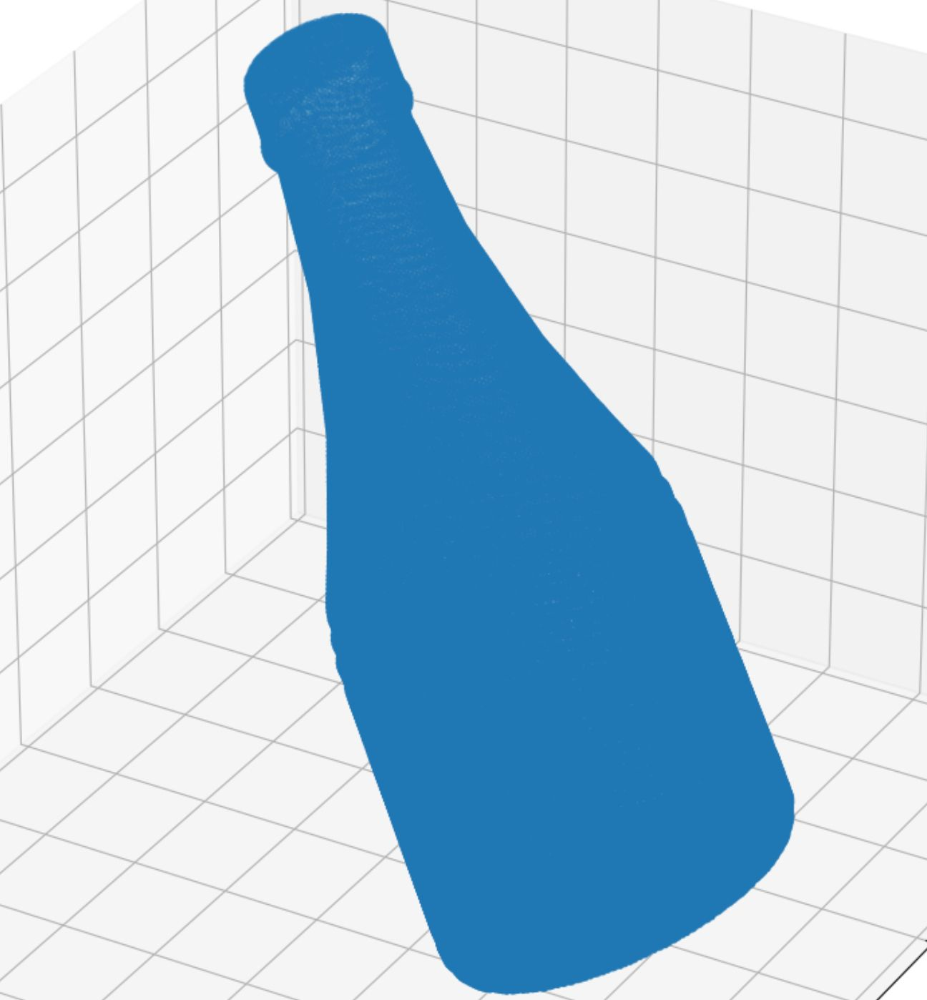
      <br/>
      <em>(a) Input Point Cloud</em>
    </td>
    <td align="center">
      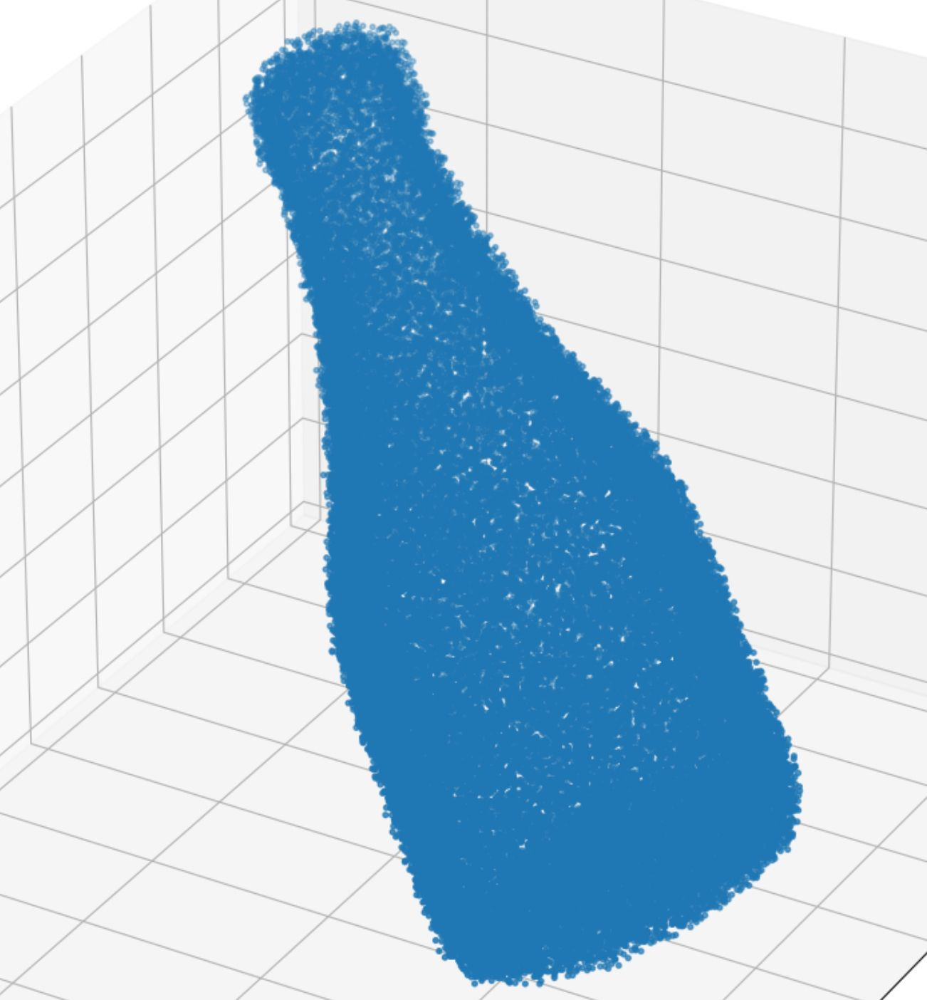
      <br/>
      <em>(b) Reconstructed Output</em>
    </td>
    <td align="center">
      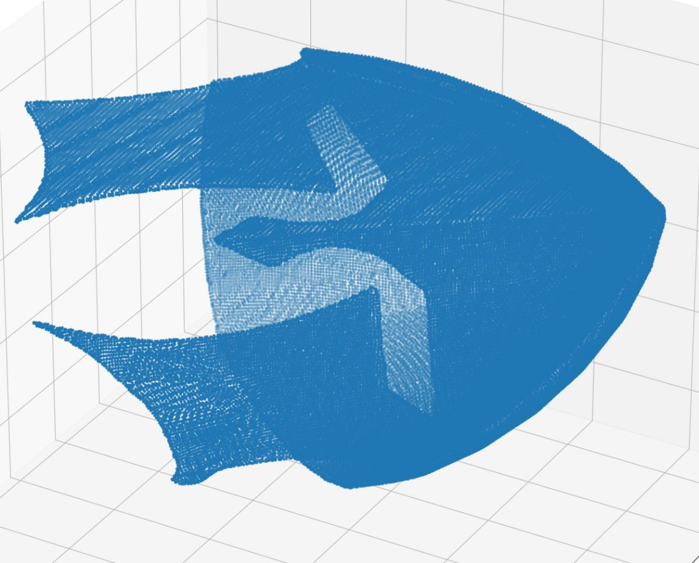
      <br/>
      <em>(a) Input Point Cloud</em>
    </td>
    <td align="center">
      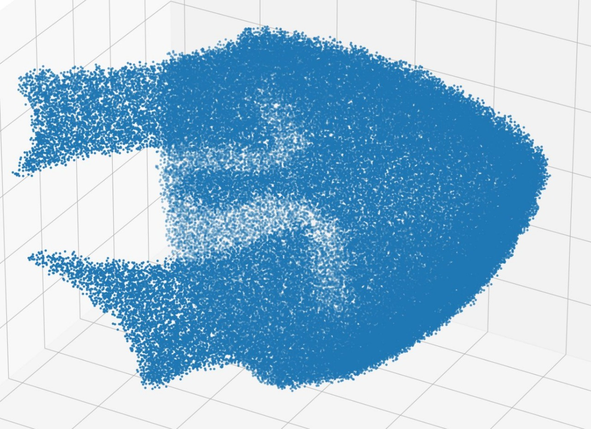
      <br/>
      <em>(b) Reconstructed Output</em>
    </td>
  </tr>
  <tr>
    <td align="center">
      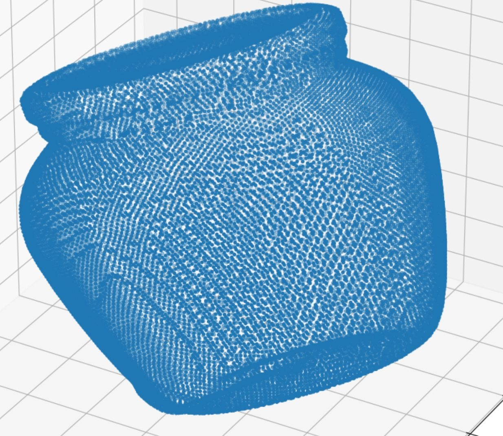
      <br/>
      <em>(a) Input Point Cloud</em>
    </td>
    <td align="center">
      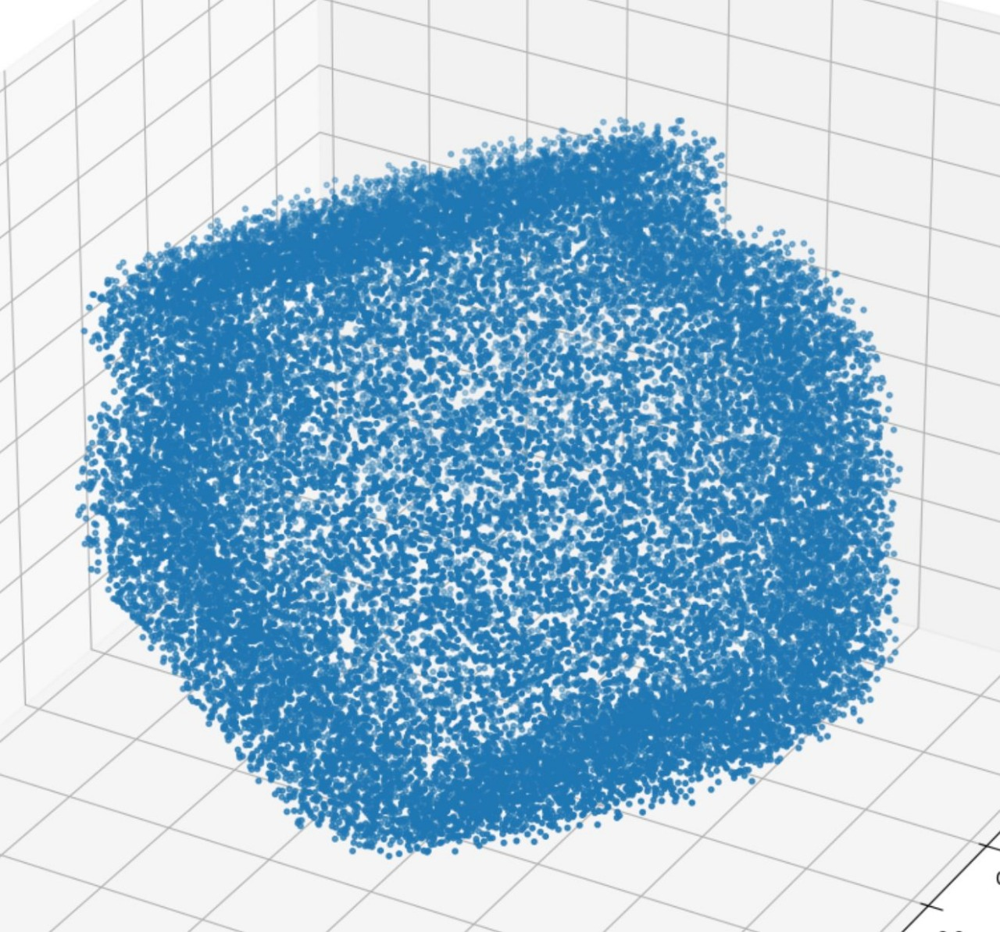
      <br/>
      <em>(b) Reconstructed Output</em>
    </td>
    <td align="center">
      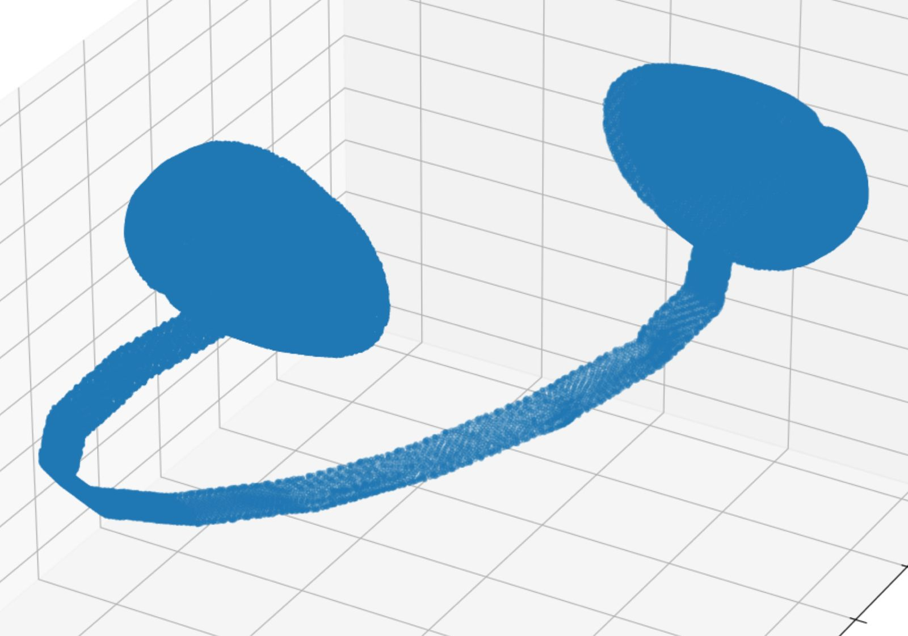
      <br/>
      <em>(a) Input Point Cloud</em>
    </td>
    <td align="center">
      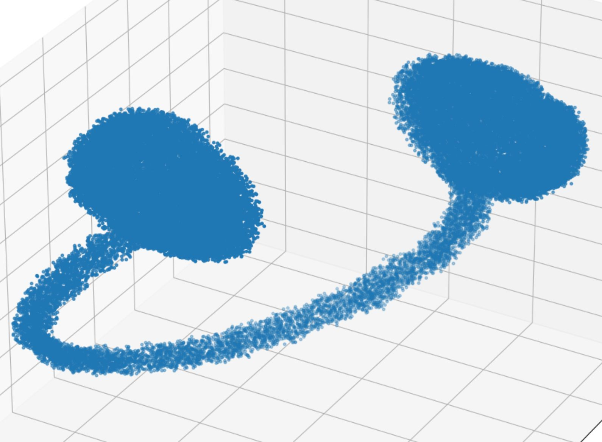
      <br/>
      <em>(b) Reconstructed Output</em>
    </td>
  </tr>
</table>

The images above were generated after training the consistency model for 1 Million iterations. Notably, the reconstructions are achieved in just two steps, in contrast to traditional diffusion models which typically require hundreds or even thousands of steps. This dramatic reduction in inference steps significantly improves speed, making the method far more suitable for real-time applications.

---
### Results on Anomaly ShapeNet Dataset
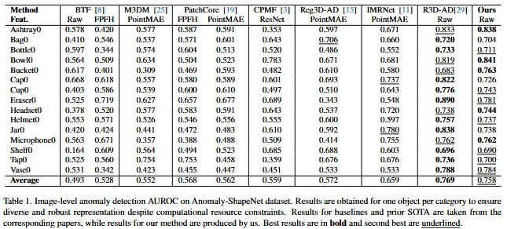

---
## Ablation Study
We perform 2 major ablations to study:<br/>
1.⁠ ⁠*The Impact of the Loss Terms* <br/>
2.⁠ ⁠*The effect of multi-step sampling*<br/>
The results of these experiments are shown below:
<table>
  <tr>
    <td align="center">
      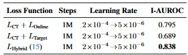
      <br/>
      <em>Impact of Loss Terms</em>
    </td>
  </tr>
  <tr>
    <td align="center">
      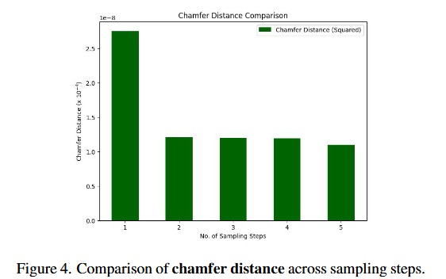
      <br/>
      <em>Chamfer Distance Vs No. Of Sampling Steps</em>
    </td>
  </tr>
</table>

## Citations
@article{song2023consistency,<br/>
  title={Consistency Models},<br/>
  author={Song, Yang and Meng, Chenlin and Ermon, Stefano},<br/>
  journal={arXiv preprint arXiv:2303.01469},<br/>
  year={2023}<br/>
}

@inproceedings{cao2023r3dad,
  title={R3D-AD: Reconstructing 3D Shapes for Unsupervised Anomaly Detection in Point Clouds},<br/>
  author={Cao, Xiyang and Zhang, Ziyang and Liu, Lanqing and Yan, Xiaokang and Yang, Kailun and Zhao<br/> Hengshuang and Geiger, Andreas and Shi, Jianping},<br/>
  booktitle={Proceedings of the IEEE/CVF Conference on Computer Vision and Pattern Recognition (CVPR)},<br/>
  year={2023}<br/>
}
